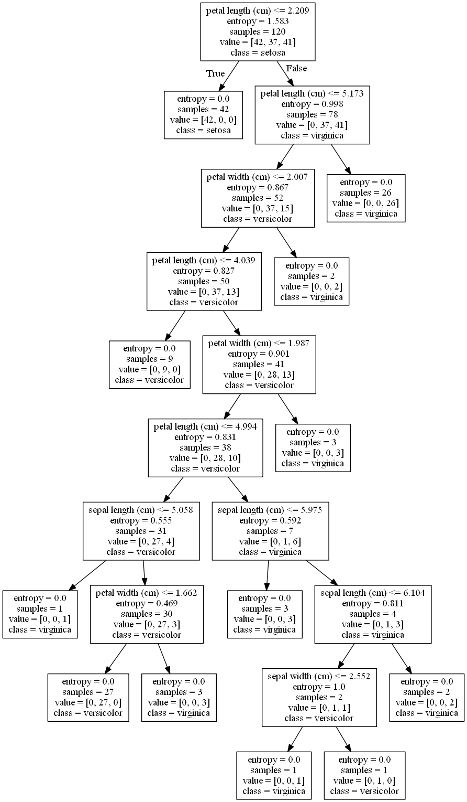

#### 使用决策树分类鸢尾花数据集
##### 该数据集有150组无缺失值的数据，有4个特征，分为三个类别
##### 该决策树使用120组数据训练，30组数据用来测试，得到的决策树见
##### 决策树构建采用sklearn.tree中的DecisionTreeClassifier类，主要参数有
##### - **criterion:** 此参数用来评估划分的质量，默认是“Gini”指数
##### - **splitter:** 此参数用来在每一个节点处选择分支，默认是“best”，表明子树的划分是最优的，也可以选择“random”
##### - **max-depth:** 整数类型，默认是None
##### - **min_samples_split:** 此参数用于定义分裂内部节点所需的样本的最小数目
##### - **max_leaf_nodes:** 默认是None
#### 决策树相关知识

1. ##### CART决策树

   ###### 基尼指数计算 

   ###### 基尼值 $$Gini(D) = 1 - \sum_{k=1}^{|C|}p_k^2$$，

   ###### 因此属性a的基尼指数$Gini\_index(D,a)=\sum_{v=1}^V\frac{|D^v|}{D}Gini(D^v)$ 其中$V$表示属性a的取值，$D^v$ 表示属性a取值为$v$ 的情况，基尼指数越小，纯度越高

2. ##### ID3决策树

   ###### 信息增益--缺点是对可取值数目较多的属性有所偏好，比如编号

   ###### 信息熵 $$Ent(D) = -\sum_{k=1}^{|C|}p_k \log_2p_k$$

   ###### 属性a对样本集D的信息增益$Gain(D,a)=Ent(D)-\sum_{v=1}^V\frac{D^v}{D}Ent(D^v)$信息增益越大，纯度越高

3. ##### C4.5决策树

   ###### 信息增益率--对可取值数目较少的属性有所偏好

   ###### 划分最优属性的方法：先从候选属性中找出**信息增益高于平均水平的属性**，再从中选择增益率最高的

